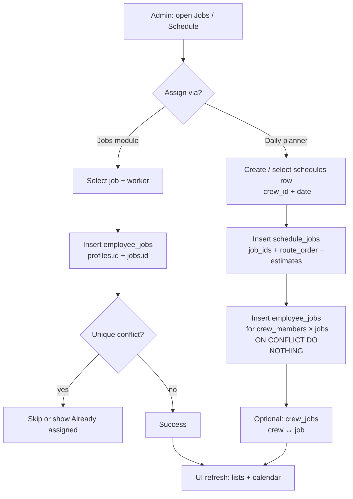
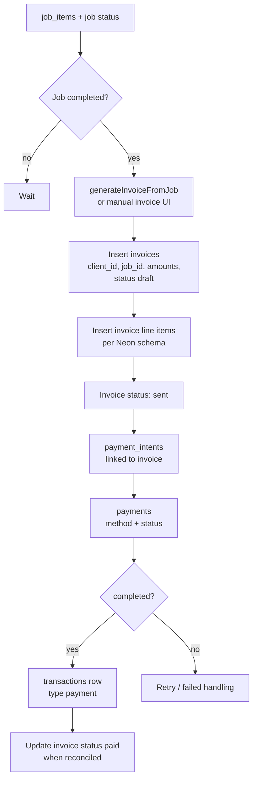

# System Flow — Source of Truth (Data & Operations)

**Audience:** Engineers onboarding to the yarding-app codebase.  
**Scope:** End-to-end business data movement, status semantics, relationships, and integrity rules.  
**Schema authority:** PostgreSQL (Neon) — full inventory in `schema-summary.txt`; Prisma models in `prisma/schema.prisma` are a **subset** (not all operational tables are in Prisma).

---

## Table of Contents

1. [End-to-End Lifecycle](#1-end-to-end-lifecycle)
2. [State Machine Analysis](#2-state-machine-analysis)
3. [Entity Relationships](#3-entity-relationships)
4. [Mermaid Flowcharts](#4-mermaid-flowcharts)
5. [Referential Integrity on Job Completion](#5-referential-integrity-on-job-completion)
6. [Code Map (Where Logic Lives)](#6-code-map-where-logic-lives)

---

## 1. End-to-End Lifecycle

### 1.1 Narrative: `quote_requests` → `jobs` → `schedules` → `employee_jobs` → `invoices`

| Stage | Primary tables | What happens |
|-------|----------------|--------------|
| **Intake** | `quote_requests` | Public/admin captures estimate inputs (client contact, service, pricing range, `breakdown_metadata`). Status starts `pending`. |
| **Review / send** | `quote_requests`, `admin_notifications` | Admin reviews, may set `approved_*_cents`, `message_to_client`. Status → `reviewed` or `sent`; `sent_at` when sent. |
| **Convert to job** | `quote_requests`, `clients`, `jobs` | Application creates (or matches) `clients` by email, inserts `jobs` with site address, `quoted_price_cents`, `status = quoted`, optional `quote_request_id` FK. Quote row typically → `reviewed`. |
| **Operational scheduling** | `schedules`, `schedule_jobs`, `crews`, `crew_members` | A **work day** for a crew: one `schedules` row (`crew_id`, `date`) and N `schedule_jobs` rows (`job_id`, `route_order`, estimated times). |
| **Worker assignment** | `employee_jobs` | Links `profiles.id` (worker) to `jobs.id`. May be created when planning a day (crew roster × selected jobs), from Jobs UI, or other flows. Unique `(employee_id, job_id)` prevents duplicate assignment rows. |
| **Execution** | `time_entries`, `schedule_jobs` (actuals) | Clock in/out records labor; optional updates to `schedule_jobs.actual_*` for dispatch accuracy. |
| **Billing** | `job_items`, `invoices`, `invoice_line_items` (in full Neon schema; not in current Prisma subset), `payment_intents`, `payments`, `transactions` | Invoice generated from completed work / line items; payments recorded against client/invoice. |

### 1.2 Data shape highlights

- **Job site address** lives on **`jobs`** (`street`, `city`, `state`, `zip_code`, `country`), not on `quote_requests`. Conversion flows collect address in the UI.
- **Client identity** for billing is **`jobs.client_id` → `clients`**.
- **Crew vs worker:** Crew-level planning uses `schedules.crew_id`; worker-level accountability uses `employee_jobs` and `time_entries`.

---

## 2. State Machine Analysis

Enums below match **`prisma/schema.prisma`** (Postgres enums may mirror these names).

### 2.1 `quote_request_status`

| Value | Typical trigger |
|-------|-----------------|
| `pending` | Row created from quote form. |
| `reviewed` | Admin saved review / pricing; also set when converting to job (per app rules). |
| `sent` | Admin sent quote to client (`sent_at` populated). |

**Note:** There is no `approved` / `rejected` enum in Prisma for `quote_requests`; business meaning may be encoded in other fields or future migrations.

### 2.2 `job_status`

| Value | Typical meaning | Typical user/system action |
|-------|-----------------|----------------------------|
| `draft` | Internal placeholder. | Rare for converted quotes; possible for manual drafts. |
| `quoted` | Job created from quote / priced. | Convert quote → job; or mark quoted. |
| `scheduled` | On calendar / route. | Schedule work day or set job schedule fields. |
| `in_progress` | Active work. | Supervisor/worker starts work (UI or status update). |
| `completed` | Work finished. | Complete job; unlocks invoicing rules in product. |
| `cancelled` | Will not be performed. | Cancel operation. |
| `on_hold` | Paused. | Manual hold. |

**Suggested lifecycle (happy path):**  
`quoted` → `scheduled` → `in_progress` → `completed`

### 2.3 `invoice_status`

| Value | Typical trigger |
|-------|-----------------|
| `draft` | Invoice row created, not emailed. |
| `sent` | Issued to client. |
| `paid` | Payment reconciled. |
| `overdue` | Past due date / automation. |
| `cancelled` | Voided invoice. |

### 2.4 Payment-related enums (summary)

| Enum | Values (summary) | Role |
|------|------------------|------|
| `payment_intent_status` | `requires_*`, `processing`, `succeeded`, `cancelled` | Stripe-style intent pipeline. |
| `payment_status` | `pending`, `processing`, `completed`, `failed` | Concrete payment record. |
| `transaction_type` | `payment`, `refund`, `payout` | Ledger line in `transactions`. |
| `payout_status` | `pending`, `processing`, `completed`, `failed`, `cancelled` | Outbound payouts. |

### 2.5 `schedule_jobs.status` (varchar in full schema)

Stored as string (e.g. `pending`, `in_progress`, `completed`) — align UI labels with operational meaning; not identical to `job_status` but often correlated when a stop is finished.

### 2.6 `user_status` (`profiles.status`)

| Value | Effect on scheduling |
|-------|----------------------|
| `active` | Eligible for assignment lists. |
| `pending` / `inactive` | Should be filtered out of dispatch/assignment UIs. |

---

## 3. Entity Relationships

### 3.1 Clients & addresses

- **`clients`**: canonical account for billing and CRM (`name`, `email`, `phone`, primary address columns in Prisma).
- **`client_addresses`** (Neon / `schema-summary.txt`): additional properties/locations for a client when the product uses them.
- **`jobs`**: carries **work site** address for this engagement; `client_id` links to who pays.

```text
clients (1) ──< jobs (many)
clients (1) ──< client_addresses (many)   [if used by feature]
```

### 3.2 Workers (`profiles`) and HR

- **`profiles`**: person record (`full_name`, `avatar_url`, `status`, optional `user_id` → `User`).
- **`employee_details`**: HR fields keyed by `profile_id` (rates, department, `employee_number`, etc.).
- **`employee_jobs`**: **assignment** `profiles.id` ↔ `jobs.id` (+ `role_in_job`, `status`).
- **`crew_members`**: `employee_id` → **`profiles.id`**, `crew_id` → `crews.id` (roster).
- **`time_entries`**: `employee_id` → **`profiles.id`**, `job_id` → `jobs.id`.

```text
profiles (1) ──< employee_details (0..1)
profiles (1) ──< employee_jobs (many)
profiles (1) ──< crew_members (many)
profiles (1) ──< time_entries (many)
crews (1) ──< crew_members (many)
```

### 3.3 Equipment

- **`equipment`**: asset registry (status, location, optional `current_job_id`, `current_crew_id`).
- **`equipment_assignments`**: checkout to **`jobs`** and/or **`profiles`** (`returned_at` null = open assignment).
- **`employee_equipment_certifications`**: in full schema, `employee_id` references **`employee_details.id`** (not `profiles.id`) — joins must go through `employee_details`.

```text
equipment (1) ──< equipment_assignments (many) ──> jobs
equipment (1) ──< equipment_assignments (many) ──> profiles (optional)
employee_details (1) ──< employee_equipment_certifications (many) ──> equipment
```

### 3.4 Quotes → Jobs link

```text
quote_requests (1) ──< jobs (many)   via jobs.quote_request_id (nullable, SetNull on quote delete in Prisma)
```

---

## 4. Mermaid Flowcharts

### 4.1 Job assignment workflow



### 4.2 Billing / payment cycle



---

## 5. Referential Integrity on Job Completion

Completing a job is primarily an **application transaction** (unless you add DB triggers). Foreign keys ensure the database stays consistent when rows are created, updated, or deleted.

### 5.1 Updates that usually occur

1. **`jobs`**: `status` → `completed`, optional `completed_at`, `completed_by` → `profiles.id`.
2. **`invoices`**: `INSERT` with `job_id` → must reference an **existing** `jobs.id`; `client_id` → existing `clients.id`.
3. **`job_items`**: Already tied with `ON DELETE CASCADE` from Prisma — deleting a job removes line items (use soft-delete `deleted_at` on jobs if you need to retain history without breaking FKs).

### 5.2 What FKs *prevent*

| Scenario | Protection |
|----------|------------|
| Invoice for non-existent job | `invoices.job_id` FK to `jobs.id` rejects bad insert. |
| Invoice for wrong client | App should set `client_id` = `jobs.client_id`; FK ensures client exists. |
| Orphan payment intent | `payment_intents` → `clients`, optional `invoices`. |
| Duplicate assignment row | `employee_jobs @@unique([employee_id, job_id])`. |

### 5.3 What FKs *do not* auto-do

- They do **not** auto-create invoices when `job_status` changes — that is **application logic**.
- They do **not** auto-close `time_entries` — clock-out is explicit.
- **`quote_requests` deletion**: Prisma relation `jobs.quote_request_id` uses `onDelete: SetNull` — deleting a quote does not delete jobs; it clears the link.

### 5.4 Cascade reference (from Prisma)

- `job_items` → `jobs`: **Cascade** on delete.
- `employee_jobs` → `jobs`: **Cascade** on delete (verify in DB if custom migrations differ).
- `time_entries` → `jobs`: check DB — treat as sensitive; completion should not delete time rows.

---

## 6. Code Map (Where Logic Lives)

| Concern | Location |
|---------|----------|
| Quote CRUD / list | `app/actions/quoteRequest.ts` |
| Quote → job conversion | `src/services/quoteService.ts`, `app/actions/quoteConversion.ts` |
| Work day: schedules + schedule_jobs + employee_jobs | `src/services/schedulePlannerService.ts`, `app/actions/schedulePlanner.ts` |
| Job CRUD / assignment (Neon) | `src/services/jobService.ts`, `src/services/assignmentService.ts` |
| Crew data | `src/services/crewService.ts` |
| Auth / admin gate | `app/(dashboard)/admin/layout.tsx` |
| Legacy workflow doc | `WORKFLOW_DATAFLOW.md` |

---

## Document control

| Version | Notes |
|---------|--------|
| 1.0 | Initial SYSTEM_FLOW aligned to Prisma + `schema-summary.txt`. |

When schema or product rules change, update **this file** and the relevant service/action modules together.
