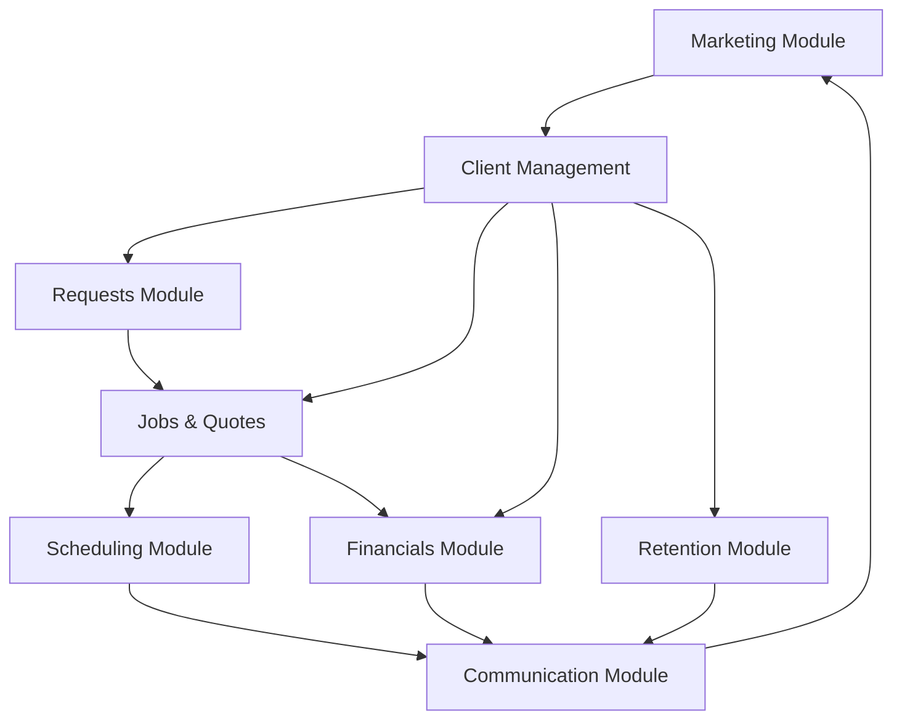
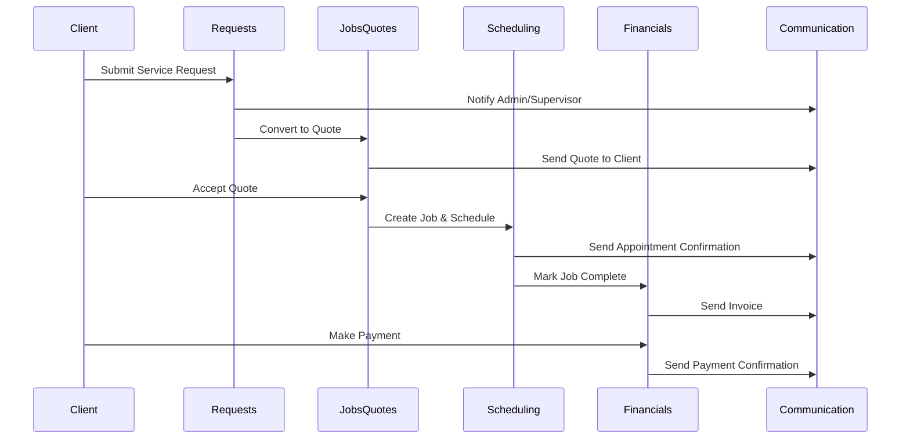

# Module Dependencies & Data Flow

## Module Dependency Graph

## Data Flow Diagram

## Module Interaction Matrix

| Module | Depends On | Provides To |
|--------|-----------|-------------|
| **Client Management** | None (Foundation) | Requests, Jobs & Quotes, Financials, Retention |
| **Requests** | Client Management | Jobs & Quotes, Scheduling |
| **Jobs & Quotes** | Client Management, Requests | Scheduling, Financials |
| **Scheduling** | Jobs & Quotes, Client Management | Financials, Communication |
| **Financials** | Jobs & Quotes, Client Management | Retention, Communication |
| **Communication** | All Modules | All Modules (Notification Hub) |
| **Retention** | Client Management, Financials, Scheduling | Communication, Marketing |
| **Marketing** | Client Management, Retention | Client Management (Leads) |

## Cross-Module Integration Points

### Communication Hub
- **Triggers from**: All modules
- **Sends to**: All roles (Admin, Supervisor, Worker, Client)
- **Channels**: Email, SMS, In-app, Push

### Client Management Hub
- **Used by**: All modules
- **Provides**: Client data, contact info, history
- **Central**: Single source of truth for client information

### Financials Integration
- **Receives from**: Jobs & Quotes (invoices), Scheduling (billable hours)
- **Provides to**: Retention (payment patterns), Reports (revenue)
